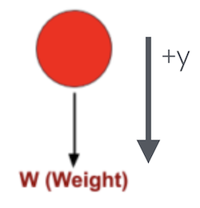
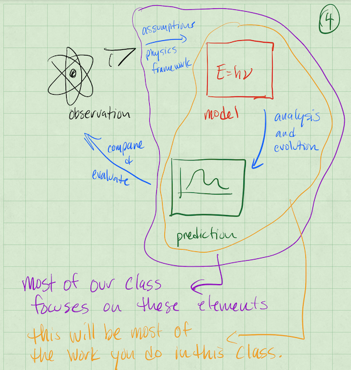
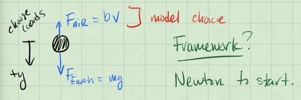

# Week 3 - Notes: Making Classical Models

The central enterprise of physics is making and testing models of physical systems. These models we developed are based on the assumptions we make about the physical systems we are studying. As we characterize the system, we make simplifying assumptions that allow us to describe the system in terms of a few key quantities. These quantities are often called the ["degrees of freedom"](https://en.wikipedia.org/wiki/Degrees_of_freedom_(physics_and_chemistry)) of the system.

In Classical Mechanics, we will use formulations of physics, such as [Newton's Laws](https://en.wikipedia.org/wiki/Newton%27s_laws_of_motion), to describe the motion of particles. We can also use the [Lagrangian](https://en.wikipedia.org/wiki/Lagrangian_mechanics) and [Hamiltonian](https://en.wikipedia.org/wiki/Hamiltonian_mechanics) formulations of mechanics. These formulations are mathematical expressions of the physical laws that govern the motion of particles.

Typically, those expressions are [differential equations](https://en.wikipedia.org/wiki/Differential_equation) that describe how the system evolves in time. Our work in classical mechanics is to develop techniques and tools that let us investigate the solutions to these equations. These differential equations are commonly called [equations of motion](https://en.wikipedia.org/wiki/Equations_of_motion) (EOM). An equation of motion describes the evolution of the agents (particles) as they interact with their surroundings and each other.

## Newtonian Examples of Classical Models

From a Newtonian perspective, our equations of motion are often second-order differential equations. This stems from the fact that Newton's second law relates the acceleration of a particle to the forces acting on it. The second law is given by the equation:

$$\vec{F}_{\text{net}} = m \vec{a} = m\ddot{\vec{x}}$$

where $\vec{x}$ is the position vector and $\ddot{\vec{x}}=\frac{d^2\vec{x}}{dt^2}$ is the acceleration vector. Thus, Newton's second law is a general EOM that describes the dynamics of a particle of mass, $m$:

$$\frac{d^2\vec{x}}{dt^2} = \dfrac{\vec{F}_{\text{net}}}{m}$$

```{admonition} What is Dynamics?

Dynamics is the study of the time evolution of a system in question. In classical mechanics, dynamics is the study of the motion of particles and the forces that cause that motion. In other physics, dynamics can refer to the study of the evolution of a system in time and space. And here, space might be an abstraction, such as a [phase space](https://en.wikipedia.org/wiki/Phase_space). We study phase spaces later in the term.
```

### Example: Falling Ball with No Air Resistance

Consider a ball of mass $m$ falling down. We define the positive $y$ direction to be down as in the figure showing the FBD of the ball. 



We can apply Newton's laws to obtain the specific EOM for the ball.

$$\vec{F}_{\text{net}} = m \vec{a} = m\ddot{\vec{x}}$$

This is a 1D case in the $y$ direction,

$$F_{\text{net,y}} = W = mg = m \ddot{y}$$

Thus,

$$\ddot{y} = g$$

is the specific EOM for the ball. 

### Example: Simple Harmonic Oscillator

We will spend a lot of time studying the [simple harmonic oscillator](https://en.wikipedia.org/wiki/Harmonic_oscillator) (SHO) in this course. The SHO is a system that oscillates back and forth around an equilibrium position. It is a very common system in physics and is used a base model for many more complex systems. Consider a mass, $m$, attached to a spring with spring constant, $k$, sitting on a frictionless horizontal plane as in the figure below.


The EOM for the SHO can be derived form Newton's Second Law.

$$\vec{F}_{\text{net}} = m \vec{a} = m\ddot{\vec{x}}$$

This is a 1D case in the $x$ direction,

$$F_{\text{net,x}} = F_{\text{spring}} = -kx = m \ddot{x}$$

And thus,

$$\ddot{x} = -\dfrac{k}{m}x$$

is the specific EOM for the SHO. As we will learn, this restoring force causes the mass to oscillate back and forth around the equilibrium position, with a well known frequency, $\omega = \sqrt{\dfrac{k}{m}}$.

## Turning Observations into Models

One of the more challenging aspects of physics is how we work to make models of the observations we have. This a long and challenging process in general, but if we have a general schematic, we can make progress. The hand drawn figure below provides such a schematic.



In the schematic, our observations are the starting point. Using our framework for physics (e.g., Newton's Laws) and making the appropriate assumptions (in blue), we can develop a model (in red) of the system. By conducting analysis and investgating the evolution of the model, we produce predictions (in green). We can then compare tose predictions to our observations to evaluate how well our model describes the system.

In this class, we mostly focus on the elements circled in purple where we develop models, and use them to predict. The core part of this class is the orange circled elements of modeling and predicting. We will spend a lot of time developing the tools and techniques to make these predictions.

### Modeling Process

Making models of physical systems is greatly helped by considering the following steps:

- Identify the phenomenon or system of interest.
- Identify the interactions the system has with its surroundings.
- Choose an appropriate physics framework to investigate the system (Newton? Lagrange? Hamilton? Continuous or Discrete?).
- Sketch the system and identify the interactions, name them, and assign them to the appropriate framework.
- Choose your coordinate system and define your variables.
- Apply the appropriate physics framework to the system.
- **Obtain the equations of motion**, and make predictions.

Let's turn to an example you have seen before: the falling ball.

### Example: Falling Ball in 1D

Consider a ball of mass $m$ falling with air resistance. Here, we have already done some of the work above. We have identified the phenomenon, and started to indicate the interactions. 



In the figure above, we have identified the forces acting on the ball. We have the gravitational force, $W = mg$, and the air resistance, $F_{\text{air}}$. We have chosen the linear mode for air-resistance, which is a choice of model given the assumption that the ball moves very slowly -- *this is not a good assumption in this case*, but makes the mathematical analysis simpler.

We have also chosen our coordinate system, with the positive $y$ direction pointing down.

We choose a Newtonian framework for our physics because we are familiar with it. And thus, we can develop the EOM:

$$\vec{F}_{\text{net}} = m \vec{a} = m\ddot{\vec{x}}$$

In 1d,

$$F_{\text{net,y}} = W - F_{\text{air}} = mg - bv = m \ddot{y}$$

So that the EOM is,

$$\ddot{y} = g - \dfrac{b}{m}v$$

#### Question: What happens with $\ddot{y} = 0$?

Once the ball has no acceleration, the two forces are balanced. This is the terminal velocity of the ball. We can solve for this by setting $\ddot{y} = 0$:

$$0 = g - \dfrac{b}{m}v_{\text{term}}$$

$$v_{\text{term}} = \dfrac{mg}{b}$$

This is the terminal velocity of the ball for linear drag. When the ball reaches this speed (and does so asymptotically), the forces are balanced and the ball will fall at a constant speed.

#### Question can we solve this differential equation?

The differential equation $\ddot{y} = g - \dfrac{b}{m}v$ is a second-order differential equation for $y$. We can solve this equation analytically by recasting it as a first-order differential equation for $v$, which we solve for and then integrate to find $y(t)$.

$$\dot{v} = g - \dfrac{b}{m}v$$

We will do that later, for now, let's hack off the drag bit and return to the simple falling ball. Our simplified EOM is:

$$\ddot{y} = g$$

Note this is written as a second order ODE for $y$:

$$\dfrac{d^2y}{dt^2} = g$$

It is possible also to recast these kinds of second-order differential equations as a pair of 1st order differential equations for $y$ and $v$:

$$\dfrac{dv}{dt} = g \qquad \dfrac{dy}{dt} = v$$

This is a common technique in physics and engineering to solve second-order differential equations. Let's solve this for completeness.

$$\dfrac{dv}{dt} = g \longrightarrow \textrm{a constant}$$

We can integrate:

$$\int_{v_0}^{v(t)} dv = \int_{0}^{t} g dt$$

$$v(t) - v_0 = gt$$

We obtain the velocity as a function of time for constant acceleration:

$$v(t) = v_0 + gt$$

Now we can integrate the velocity to obtain the position as a function of time:

$$\dfrac{dy}{dt} = v \longrightarrow \textrm{a function of time}$$

$$\int_{y_0}^{y(t)} dy = \int_{0}^{t} v_0 + gt dt$$

$$y(t) - y_0 = v_0 t + \dfrac{1}{2}gt^2$$

We obtain the position as a function of time for constant acceleration, the standard kinematic equation:

$$y(t) = y_0 + v_0 t + \dfrac{1}{2}gt^2$$

Why the 'plus' sign on the last term? Because we choose positive $y$ to be down, and the ball is accelerating down.

```{note}
This is really useful, but is contingent on finding or knowing the anti-derivative of the functions we are integrating. That is not always possible. What might we do if we weren't sure that we could find the anti-derivative?
```

## Discrete Formulation of Newtonian Mechanics

Most of our experience so far has been solving problems where we can find continuous functions that are the anti-derivatives of the functions we are integrating. This leads to standard formulae that we can use to predict or plot our results. 

However, there are very few systems for which we can write down EOMs that have known solutions. In these cases, we need to turn to numerical methods to solve the equations of motion. To do this, we need a discrete formulation of the EOMs. 

Let's focus on 1D:

$$\dfrac{d^2y}{dt^2} = \dfrac{F}{m}$$

We can write this as a pair of first-order differential equations:

$$\dfrac{dy}{dt} = v \quad \textrm{and} \quad \dfrac{dv}{dt} = \dfrac{F}{m}$$

Let's allow ourselves to consider instead a small time interval of the evolution, $\Delta t$. We can then write the velocity equation as:

$$\dfrac{dv}{dt} = \dfrac{\Delta v}{\Delta t}= \dfrac{v(t+\Delta t) - v(t)}{\Delta t} = \dfrac{F}{m}$$

We can turn this into a discrete equation by multiplying through by $\Delta t$: prediction of the velocity at the next time step:

$$v(t+\Delta t) = v(t) + \dfrac{F}{m} \Delta t$$

This is the "velocity update" equation, or more generally, the [Euler step](https://en.wikipedia.org/wiki/Euler_method) for velocity. Given the information at time $t$, $F(t)$, $m$, and $v(t)$, we can predict the velocity at the next time step.

$$v(t+\Delta t) = v(t) + \dfrac{F(t)}{m} \Delta t$$

Great! But that is just for velocity, can we do the same for position?

**Yes**

We can use the same logic to predict the position at the next time step:

$$\dfrac{dy}{dt} = v$$

If we discretize this, we realize we just have the definition of the average velocity:

$$\dfrac{dy}{dt} = v_{\textrm{avg}}$$

We can then write the position update equation:

$$y(t+\Delta t) = y(t) + v_{\textrm{avg}} \Delta t$$


What is left is to determine what should be the estimate for $v_{\textrm{avg}}$. 

```{admonition} Choosing $v_{\textrm{avg}}$
:class: note

The idea that we have to pick a value for $v_{\textrm{avg}}$ is a key point in numerical methods. It might seem silly or overly subtle and it certainly the latter. We can select $v(t)$, $v(t+\Delta t)$, or some average of the two. The choice of $v_{\textrm{avg}}$ is the key to the accuracy of the method.

As we will show in a later homework, the best choice is $v(t+\Delta t)$ as it preserves the energy of the system. 
```


### Euler-Cromer Step

Taken together, we obtain the [Euler-Cromer](https://en.wikipedia.org/wiki/Semi-implicit_Euler_method) step for the position and velocity:

$$v(t+\Delta t) = v(t) + \dfrac{F(t)}{m} \Delta t$$
$$y(t+\Delta t) = y(t) + v(t+\Delta t) \Delta t$$

This method was accidentaly discovered by a high physics student called Abby Aspel. It was later explored by [Alan Cromer](https://en.wikipedia.org/wiki/Alan_Cromer) whote wrote up this [method in the American Journal of Physics](https://aapt.scitation.org/doi/10.1119/1.10903). 


In three-dimensions, this method is simply written in a vector form:

$$\vec{v}(t+\Delta t) = \vec{v}(t) + \dfrac{\vec{F}(t)}{m} \Delta t$$
$$\vec{r}(t+\Delta t) = \vec{r}(t) + \vec{v}(t+\Delta t) \Delta t$$


```{admonition} Erasing Contributions in Physics
:class: note
This method should be called the Euler-Aspel-Cromer method because Euler started it, Aspel discovered it, and Cromer formalized it. 

It is not because physics and physicists tend to erase the contributions of marginalized groups including young people, women, and folks from non-dominant groups.

**Don't believe it?**

Read about the [history of the MIT physics department](https://physics.mit.edu/about-physics/our-history/) and try to find the contributions of the many technical staff, non-tenure track faculty, and students who have made the department what it is today.
```

## Analytical Solutions to the Air-Resistance Problem

We can solve the air-resistance problem analytically. We have the EOM for velocity:

$$\dot{v} = g - \dfrac{b}{m}v - \dfrac{c}{m}v^2$$

### Linear Drag

Let's take the linear limit first, $c=0$. 

$$\dot{v} = g - \dfrac{b}{m}v$$

We can solve this equation by separating variables:

$$\dfrac{dv}{g - \dfrac{b}{m}v} = dt$$

We can integrate both sides:

$$\int \dfrac{dv}{g - \dfrac{b}{m}v} = \int dt$$

$$-\dfrac{m}{b} \ln|g - \dfrac{b}{m}v| = t + C$$

We can solve for $v(t)$:

$$g - \dfrac{b}{m}v = e^{-\dfrac{b}{m}t - C}$$

$$v(t) = \dfrac{mg}{b} - e^{-\dfrac{b}{m}t - C}$$

We can solve for the constant $C$ by using the initial condition $v(0) = v_0$:

$$v_0 = \dfrac{mg}{b} - e^{-C}$$

$$e^{-C} = \dfrac{mg}{b} - v_0$$

$$v(t) = \dfrac{mg}{b} - \left(\dfrac{mg}{b} - v_0\right)e^{-\dfrac{b}{m}t}$$

When $v_0 = 0$, we find:

$$v(t) = \dfrac{mg}{b}\left(1 - e^{-\dfrac{b}{m}t}\right)$$

And as $t \to \infty$, we find the terminal velocity:

$$v_{\text{term}} = \lim_{t \to \infty} v(t) = \dfrac{mg}{b}$$

### Quadratic Drag

In the case of quadratic drag, we have:

$$\dot{v} = g - \dfrac{c}{m}v^2$$

We can find the terminal velocity by setting $\dot{v} = 0$:

$$0 = g - \dfrac{c}{m}v_{\text{term}}^2$$

$$v_{\text{term}} = \sqrt{\dfrac{mg}{c}}$$


Thus, we recast the problem in terms of the terminal velocity:

$$\dot{v} = g\left(1 - \dfrac{v^2}{v_{\text{term}}^2}\right)$$

We can separate variables and integrate:

$$\int \dfrac{dv}{1 - \dfrac{v^2}{v_{\text{term}}^2}} = \int g dt$$

#### Assume we start at rest, $v(0) = 0$

We can solve for $v(t)$, by using the proper limits:

$$\int_{0}^{v(t)} \dfrac{dv}{1 - \dfrac{v^2}{v_{\text{term}}^2}} = \int_{0}^{t} g dt$$

This is a known integral and yields:

$$\dfrac{v_{\text{term}}}{2}\ln\left|\dfrac{v_{\text{term}} + v}{v_{\text{term}} - v}\right| = gt$$

With the initial condition $v(0) = 0$, we find:

$$\dfrac{v_{\text{term}}}{g} \tanh^{-1}\left(\dfrac{v}{v_{\text{term}}}\right) = t$$

And thus, we find the velocity as a function of time:

$$v(t) = v_{\text{term}}\tanh\left(\dfrac{gt}{v_{\text{term}}}\right)$$


```python

```


